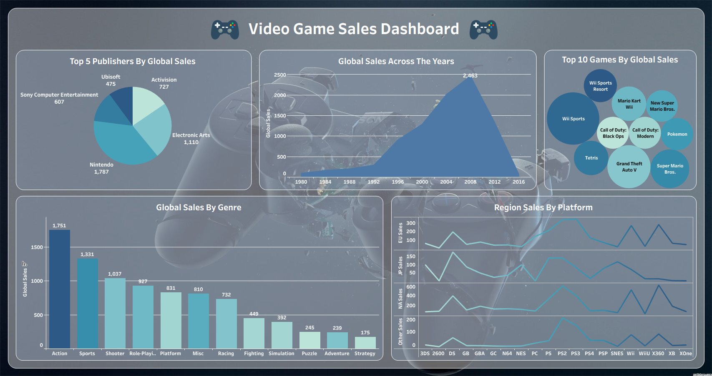

# tableau-vgsales-dashboard

## Preview

  

## Dashboard Questions
- Which game genres generate the highest global sales?
- Which publishers have produced the highest-selling games globally?
- How have global video game sales changed over time?
- Which platforms are the most popular across different regions?
- What are the top 10 selling video games worldwide?

## Key Insights
- The Action genre generates the highest global sales, with approximately 1,751 million in global sales.
- Nintendo has sold the most games globally among the publishers shown, followed by Electronic Arts and Activision.
- The video game market grew strongly over the years and peaked between 2008 and 2012, before experiencing a significant decline.
- PlayStation platforms are generally the most popular across regions, while Nintendo DS is especially popular in Japan.
- The top selling games are dominated by well-known franchises, with Wii Sports leading global sales.
